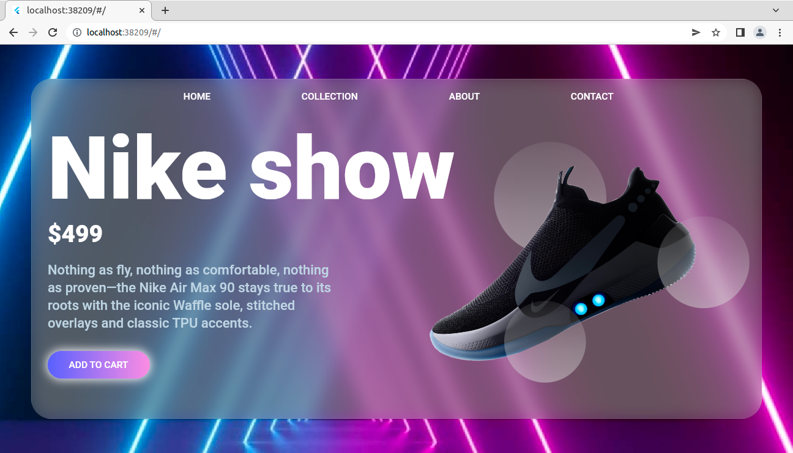
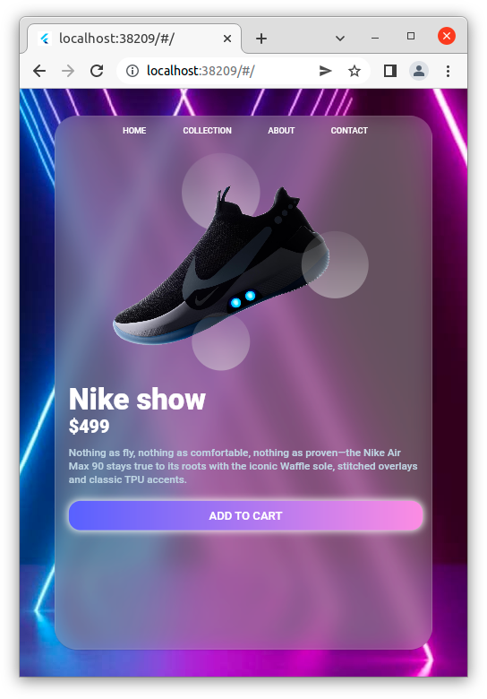
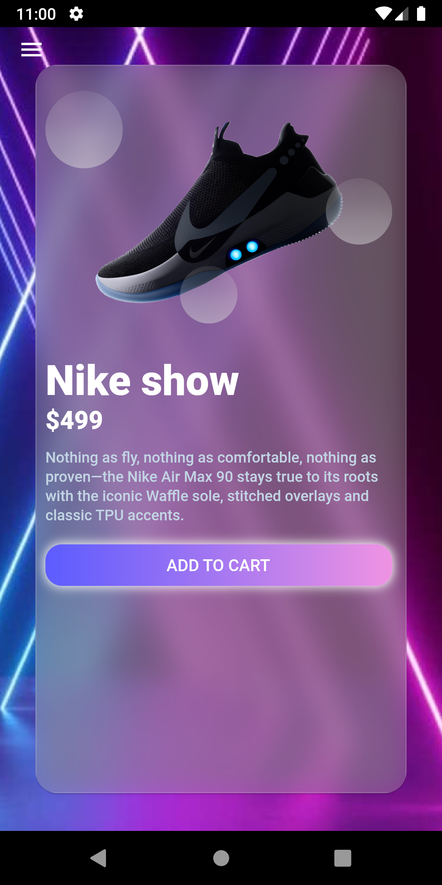
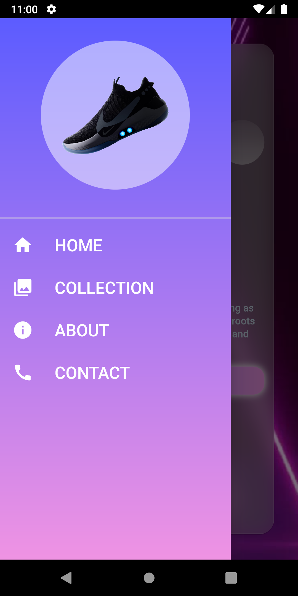

# nike_landing_page

A new Flutter Web project.

## Responsive Flutter WebPage 

A Nike website landing page concept developed in Flutter which supports Mobile, Tablet and Desktop view .

## Packages Used

- [Glass_kit Package](https://pub.dev/packages/glass_kit)
- [Google_fonts Package](https://pub.dev/packages/google_fonts)
- [Responsive_builder Package](https://pub.dev/packages/responsive_builder)

 
 ## Screenshot


 
  

## Build Instructions

### Install Flutter

Built with [Flutter](https://flutter.dev/), you need to have `Flutter` dev tools
installed on your computer to compile the project. check [Flutter Documentation](https://flutter.dev/docs)
 to learn how to install `Flutter` and initialize a Flutter App.
 
  
### Run App

If you have an AVD or real device attached, you can do

```
flutter run 
```

### Build APK

You may build the App with Flutter's [Deployment Documentation](https://flutter.dev/docs).

In order to build a fat APK, you can do 
```
flutter build apk
```
and find the output in `build/app/outputs/flutter-apk/app-release.apk`

#### Dev hints

Currently supports flutter: 3.0.1

  
# How to get this Repo and run it on your System

I kept the code as original as possible with proper Commented Guides for anyone to understand and implement. Still you need to follow these steps.
  - First get Flutter and all necessary SDK/Plugins installed. Full guide here [Flutter: Get Started](https://flutter.dev/docs/get-started/install)
  - Now download this [Repo](https://github.com/jinosh05/nike_landing_page/archive/refs/heads/master.zip)
  - Extract the Repo into your newly created **nike_landing_page** and replace the required files.
  - Now you can Finally run VS-Code or Android Studio whichever you prefer and get the flutter packages and just run the App.
  

## 🔗 Useful links

🌐 Web App: [https://jocular-banoffee-479043.netlify.app/](https://jocular-banoffee-479043.netlify.app/)

📱 Android App:Download the release APK 


